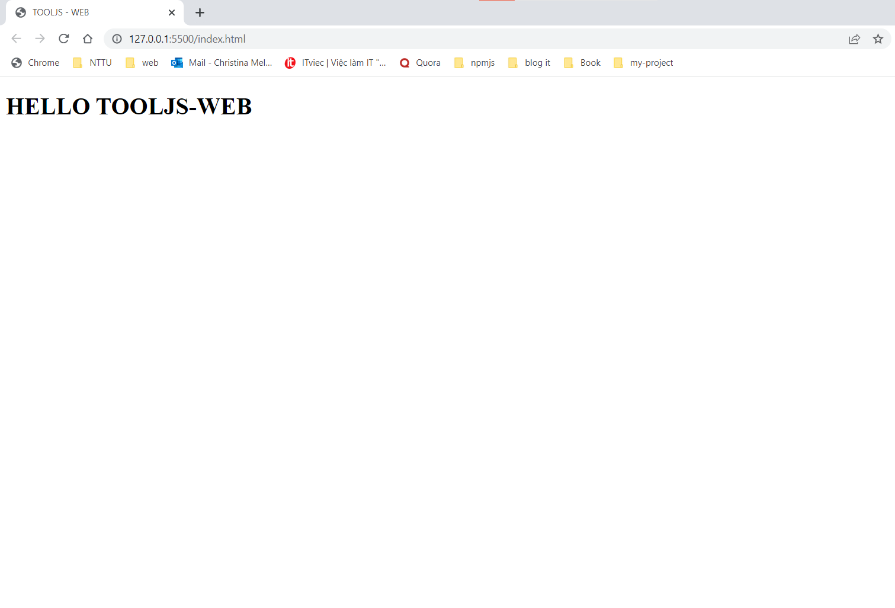

# tooljs-web

This is a package that allows you to write functional components like reactjs, `tooljs-web` is essentially a string.
Wish you have a pleasant experience.

**Author: Dang Duy Duc**

---

# Install

```
npm install tooljs-web
```

# Structure project

```
/node_module
/src
|    ...
|   |-- /store
|   |   |-- index.js
|   |   |-- action.js
|   |   |-- reducer.js
|   |   |-- constants.js
|   |-- App.js
|-- index.html
|-- index.js
|-- tooljsWeb.js
...
package-lock.json
package.json
```

# Quick start

**Step 1:** File: `./index.html`, add tag `script`

```HTML
<!DOCTYPE html>
<html lang="en">
<head>
    <meta charset="UTF-8">
    <meta http-equiv="X-UA-Compatible" content="IE=edge">
    <meta name="viewport" content="width=device-width, initial-scale=1.0">
    <title>TOOLJS - WEB</title>
    <!-- link script -->
    <script defer type="module" src="./index.js"></script>
</head>
<body>
    <div id="root"></div>
</body>
</html>
```

**Step 2:** File `./src/store/reducer.js`, create variable `initState` which is the initial value of `state` parameter of `reducer` function. In addition, the `reducer` function has two more parameters, `type` and `action`. `Type` is the case name, `action` is the action that the user submits data. Finally, we export method `reducer`.

```Javascript
// state initial
const initState = {

};

const reducer = (state = initState, type, action) => {
    switch (type) {
        case ...: // case name

           return {
               ...state, // handling user-submitted data
               ...
           }

        default:
            return state // If there are no instances, return state
    }
}

export default reducer;
```

**Step 3:** File `./tooljsWeb.js`, import package `tooljs-web`, then export all out.

```JavaScript
export * from './node_modules/tooljs-web/index.js'
```

**Step 4:** File `./src/store/index.js`, import `createStore` and put `reducer` in the argument of `createStore`. Finally export it all out.

```Javascript
// import `createStore`
import { createStore } from '../../tooljsWeb.js';
import reducer from './reducer.js';

export const { createRoot, useSelector, connectStore, useDispatch } = createStore(reducer);
```

**Step 5:** File `./src/App.js`, import `html` from `tooljs-web`, create functional component `App`.

```Javascript
import { html } from '../tooljsWeb.js'

const App = () => {

    return html
        `
            <h1>HELLO TOOLJS-WEB</h1>
        `
}

export default App
```

**Step 6:** File `./index.js`, import `App` component, import `createRoot` and `render` them.

```Javascript
import App from './src/App.js';
import { createRoot } from './src/store/index.js';

const root = createRoot(document.getElementById('root'));

// render app
root.render(App);
```

**Step 7:** Use extension `Live Server`, click `Go Live` below.

**Result:**


